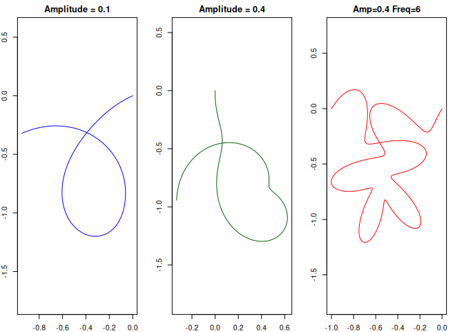
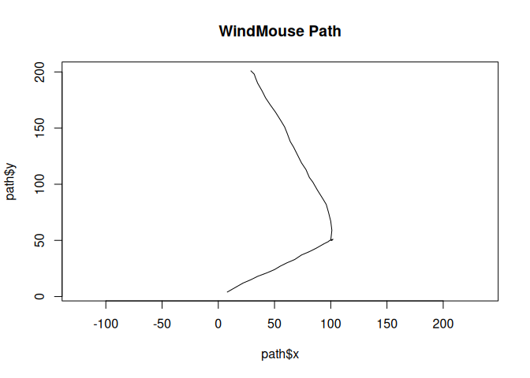

<!-- README.md is generated from README.Rmd. Please edit that file -->

# rasengan

<!-- badges: start -->
<!-- badges: end -->

The code and documentation in this package was written using AI. Please
note that the content may be inaccurate!

## Usage

``` r
pkgload::load_all(export_all = FALSE)
#> ℹ Loading rasengan

# `twist_curve()` creates a smooth, looped 2D curve
op <- par(mfrow = c(1, 3), mar = c(2, 2, 2, 2))
plot(twist_curve(amplitude = 0.1), type = "l", asp = 1, col = "blue", main = "Amplitude = 0.1")
plot(twist_curve(amplitude = 0.4), type = "l", asp = 1, col = "darkgreen", main = "Amplitude = 0.4")
plot(twist_curve(amplitude = 0.4, frequency = 6), type = "l", asp = 1, col = "red", main = "Amp=0.4 Freq=6")
```



``` r

par(op)

# `wind_mouse()` creates a human-like mouse trajectory between two points
path <-
  rbind(
    wind_mouse(end = c(100, 50), seed = 123),
    wind_mouse(start = c(100, 50), end = c(30, 200), seed = 123)
  )
plot(path$x, path$y, type = "l", asp = 1, main = "WindMouse Path")
```


