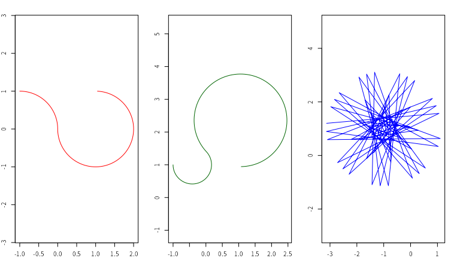
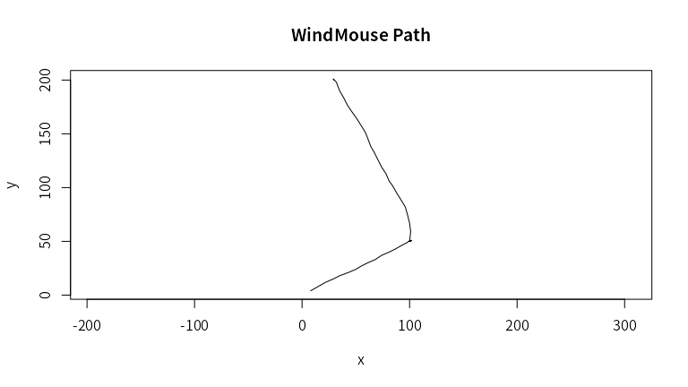

# rasengan


<!-- README.md is generated from README.qmd. Please edit that file -->

<!-- badges: start -->

[](https://github.com/paithiov909/rasengan/actions/workflows/R-CMD-check.yaml)
<!-- badges: end -->

The code and documentation in this package was written using AI. Please
note that the content may be inaccurate!

## Usage

``` r
pkgload::load_all(export_all = FALSE)
#> ℹ Loading rasengan
op <- par(mfrow = c(1, 3), mar = c(2, 2, 2, 2))

# `path_clothoid()` generates a clothoid between two points if possible
path <- path_clothoid(start = c(-1, 1, 0), end = c(1, 1, pi))
with(path, plot(x, y, type = "l", asp = 1, col = "red"))
path <- path_clothoid(start = c(-1, 1, -1 * pi / 2), end = c(1, 1, pi))
with(path, plot(x, y, type = "l", asp = 1, col = "darkgreen"))
path <- path_clothoid(start = c(-1, 1, pi / 16), end = c(15, 50, pi), biarch = FALSE)
with(path, plot(x, y, type = "l", asp = 1, col = "blue"))
```



``` r

par(op)
```

``` r
# `path_mouse()` creates a human-like mouse trajectory between two points
path <-
  rbind(
    path_mouse(end = c(100, 50), seed = 123),
    path_mouse(start = c(100, 50), end = c(30, 200), seed = 123)
  )
with(path, plot(x, y, type = "l", asp = 1, main = "WindMouse Path"))
```


